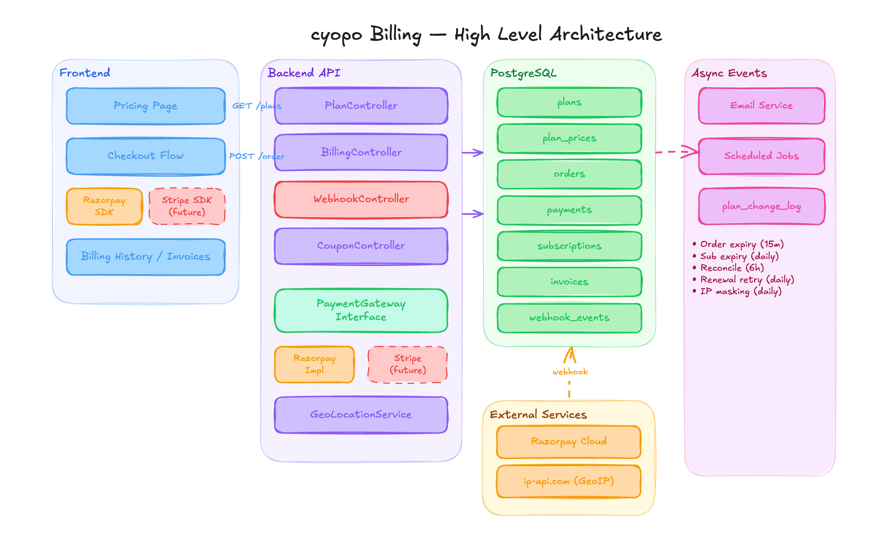
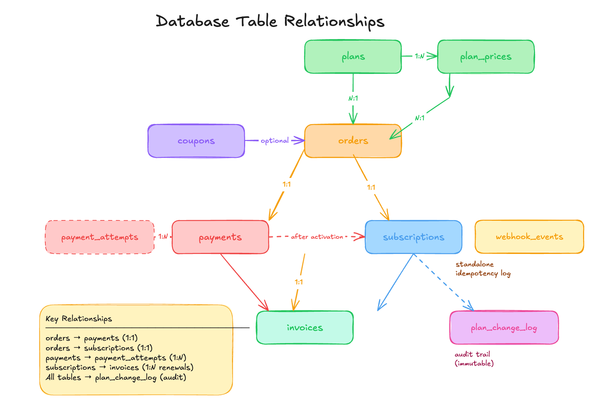
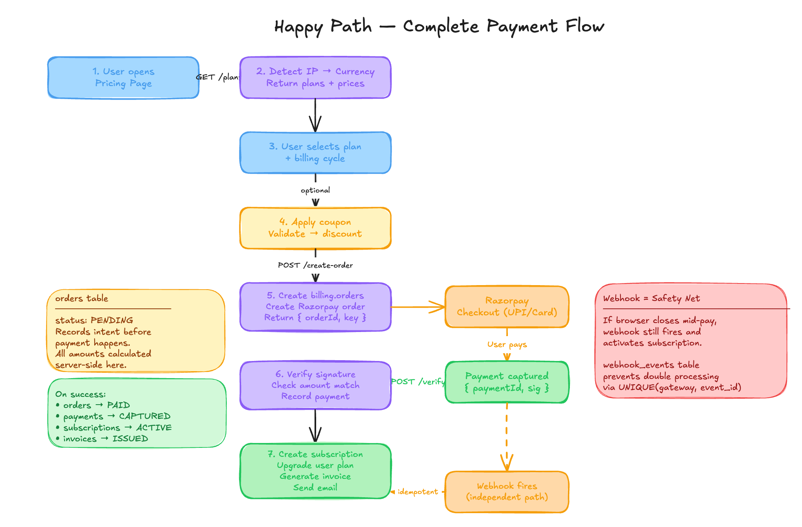
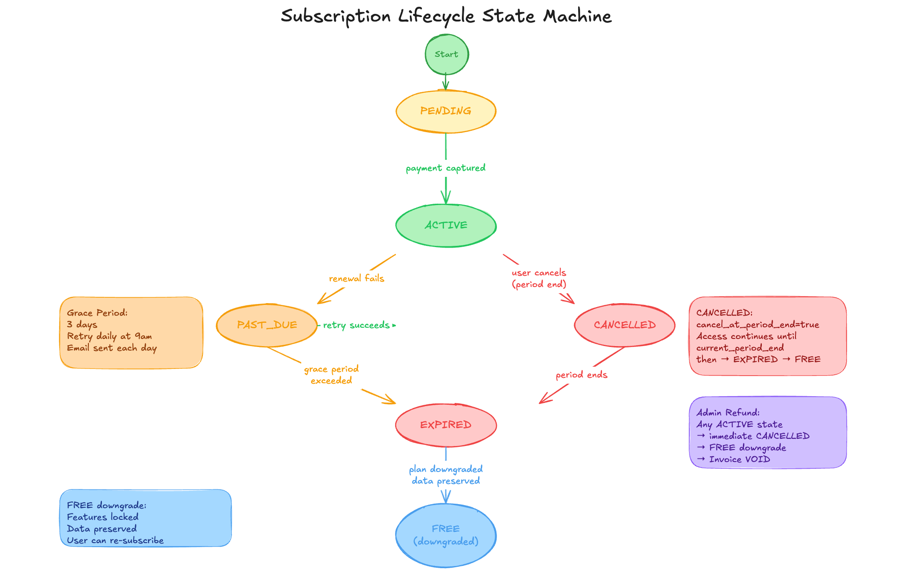
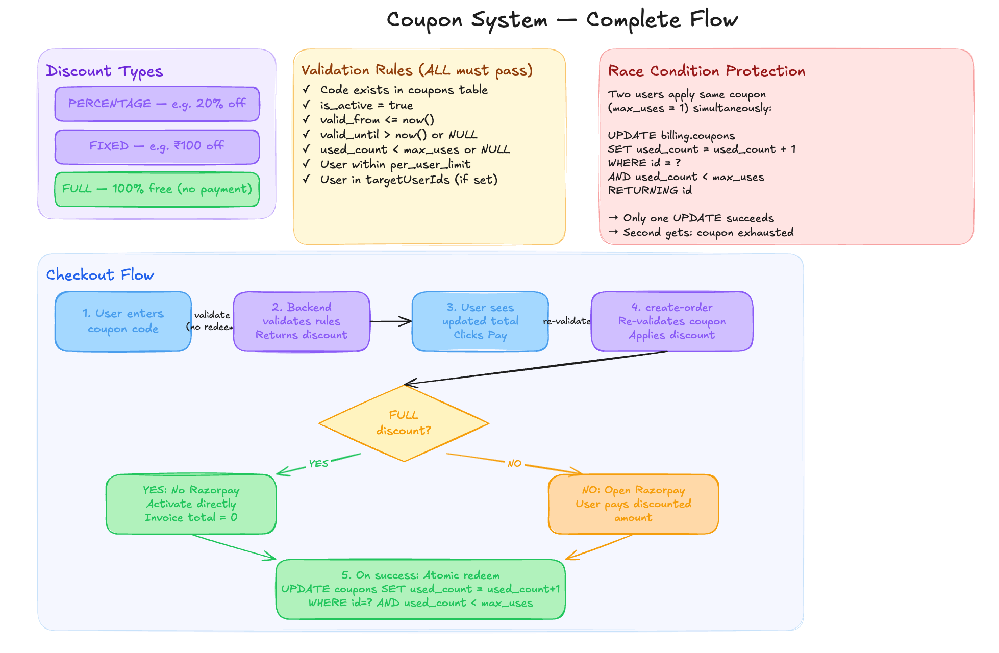
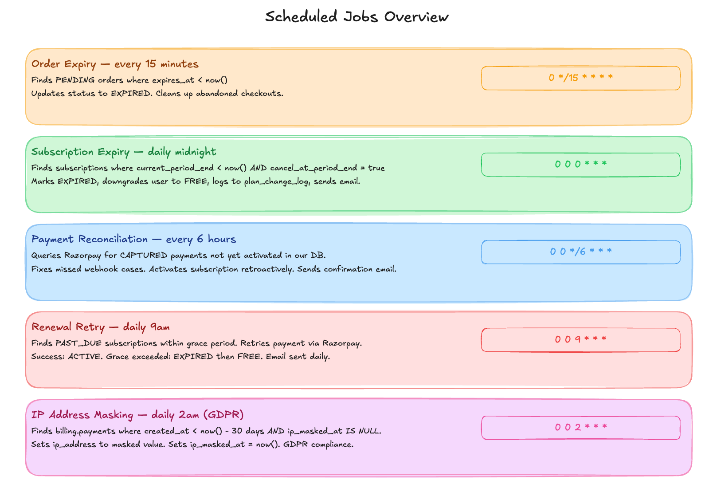

# cyopo Billing System

> Production-grade billing architecture supporting multiple plans, payment gateways, GST compliance, and complete audit
> trails.

---

## Table of Contents

1. [Overview](#overview)
2. [Plans & Pricing](#plans--pricing)
3. [Database Tables](#database-tables)
4. [Complete Payment Flow](#complete-payment-flow)
5. [Edge Cases & Handling](#edge-cases--handling)
6. [Coupon System](#coupon-system)
7. [Scheduled Jobs](#scheduled-jobs)
8. [GST & Invoice Compliance](#gst--invoice-compliance)
9. [Multi-Currency & Gateway Strategy](#multi-currency--gateway-strategy)
10. [Security](#security)
11. [Configuration](#configuration)

---

## Overview

cyopo billing is built around three core principles:

- **Webhooks are the source of truth** — never trust only the frontend redirect
- **Idempotency everywhere** — every order, payment, and webhook is deduplicated
- **Price snapshots** — what a user paid is frozen at subscription time, immune to future price changes



### Gateway Strategy

| Region | Currency | Gateway  | Status            |
|--------|----------|----------|-------------------|
| India  | INR      | Razorpay | Active            |
| USA    | USD      | Stripe   | Inactive (future) |
| UK     | GBP      | Stripe   | Inactive (future) |
| Europe | EUR      | Stripe   | Inactive (future) |

Gateway is abstracted behind a `PaymentGateway` interface — swapping Razorpay for Stripe requires only a new
implementation, zero controller changes.

---

## Plans & Pricing

### Plan Tiers

| Feature                | FREE | PREMIUM   | PRO       |
|------------------------|------|-----------|-----------|
| Portfolios             | 1    | 3         | Unlimited |
| Projects per portfolio | 3    | Unlimited | Unlimited |
| Premium templates      | ✗    | ✓         | ✓         |
| Custom domain          | ✗    | ✓         | ✓         |
| Resume upload          | ✗    | ✓         | ✓         |
| Analytics              | ✗    | ✓         | ✓         |
| Remove branding        | ✗    | ✗         | ✓         |
| Priority support       | ✗    | ✗         | ✓         |

### Pricing (INR)

| Plan    | Monthly | Annual | Savings                |
|---------|---------|--------|------------------------|
| FREE    | ₹0      | ₹0     | —                      |
| PREMIUM | ₹499    | ₹4,999 | ₹989 (2 months free)   |
| PRO     | ₹999    | ₹9,999 | ₹1,989 (2 months free) |

> All INR prices are stored in paise (₹499 = `49900` paise) to avoid floating point issues.

### DB-Driven Pricing

Plan features and bullet points are stored in the database — no code deployment needed to:

- Change prices
- Add/remove feature bullets
- Toggle a plan's visibility
- Add a new currency

---

## Database Tables

### `billing.plans`

**Purpose:** Master plan definitions with limits and UI content.

Stores what each plan *allows* — feature flags enforced by the backend on every API call. Also stores the `features`
JSONB array shown as bullet points on the pricing page. No prices here — prices live in `plan_prices`.

```
plans
  ├── name            FREE | PREMIUM | PRO
  ├── max_portfolios  Hard limit enforced by backend
  ├── allow_*         Feature flags
  ├── features        JSONB — bullet points for pricing card
  ├── badge           "Most Popular" | "Best Value" | null
  └── sort_order      Display order on pricing page
```

---

### `billing.plan_prices`

**Purpose:** Prices per plan per currency — one row per combination.

Decoupled from `plans` so adding a new currency requires only an INSERT, not a migration. Each row also carries its own
`gst_rate` (18% for INR, 0% for others) and which `gateway` handles that currency.

```
plan_prices
  ├── plan_id        → plans
  ├── currency       INR | USD | GBP | EUR
  ├── gateway        RAZORPAY | STRIPE
  ├── monthly_price  In smallest unit (paise/cents)
  ├── annual_price   In smallest unit
  ├── gst_rate       18.00 for INR, 0.00 for others
  └── is_active      false = currency not yet live
```

---

### `billing.orders`

**Purpose:** Represents a single checkout session — the intent to purchase.

Created *before* payment happens. This is the anchor of the entire payment flow. Every other table (payments,
subscriptions, invoices) traces back to an order. Expires after 15 minutes if unpaid.

```
orders
  ├── user_id         Who is buying
  ├── plan_id         What they want to buy
  ├── plan_price_id   Which price (currency + cycle)
  ├── billing_cycle   MONTHLY | ANNUAL
  ├── gateway_order_id Razorpay order_id
  ├── status          PENDING → PAID | FAILED | EXPIRED | CANCELLED
  ├── idempotency_key Prevents duplicate orders
  ├── coupon_id       Coupon applied at checkout (if any)
  ├── plan_price      Base price at time of order (snapshot)
  ├── discount_amount Coupon discount applied
  ├── subtotal        After discount, before GST
  ├── gst_amount      18% of subtotal (INR only)
  ├── total_amount    Final amount charged
  ├── subscription_id Set after activation (ALTER TABLE FK)
  ├── expires_at      now() + 15 minutes
  └── country_code    Detected from IP at checkout
```

---

### `billing.payments`

**Purpose:** Records the actual money movement for an order.

One payment per order (in happy path). Tracks every status transition from CREATED through CAPTURED or FAILED. Stores
the full Razorpay response in `gateway_response` JSONB for debugging and reconciliation.

```
payments
  ├── order_id           → orders
  ├── subscription_id    Set after activation
  ├── gateway_order_id   Razorpay order_id
  ├── gateway_payment_id Razorpay payment_id
  ├── idempotency_key    Prevents double capture
  ├── status             CREATED → CAPTURED | FAILED | REFUNDED
  ├── total_amount       Amount actually charged
  ├── gst_amount         GST portion
  ├── refund_amount      If partial/full refund
  ├── failure_code       "card_declined" | "insufficient_funds" etc
  ├── payment_method     upi | card | netbanking | wallet
  ├── ip_address         Masked after 30 days (GDPR)
  └── gateway_response   Full Razorpay JSON for debugging
```

---

### `billing.payment_attempts`

**Purpose:** Each individual try within a payment session.

Razorpay allows the user to try multiple payment methods before succeeding or giving up. Each try is a separate row
here. Enables exact debugging of "user tried UPI, it failed, then paid by card".

```
payment_attempts
  ├── payment_id         → payments
  ├── order_id           → orders
  ├── gateway_payment_id Razorpay attempt ID
  ├── status             ATTEMPTED | CAPTURED | FAILED
  ├── failure_code       Why this attempt failed
  ├── payment_method     Which method was tried
  └── gateway_response   Full Razorpay JSON for this attempt
```

---

### `billing.subscriptions`

**Purpose:** The active plan grant for a user.

Created after a payment is captured. Controls what features the user has access to right now.
`cancel_at_period_end = true` means the subscription will not renew but access continues until `current_period_end`.

```
subscriptions
  ├── user_id              Who has the subscription
  ├── plan_id              Which plan is active
  ├── order_id             Which order created this
  ├── status               ACTIVE | CANCELLED | EXPIRED | PAST_DUE
  ├── billing_cycle        MONTHLY | ANNUAL
  ├── current_period_start Start of paid period
  ├── current_period_end   End of paid period
  ├── cancel_at_period_end true = do not renew, keep until end
  ├── cancelled_at         When user cancelled
  ├── coupon_id            Coupon used (for records)
  ├── plan_price           Snapshot — immune to future price changes
  ├── gst_amount           GST snapshot
  ├── final_amount         What was charged (snapshot)
  ├── grace_period_end     For PAST_DUE — window before downgrade
  └── retry_count          How many renewal retries attempted
```

---

### `billing.invoices`

**Purpose:** Legal billing document generated after every successful payment.

Sequential invoice numbers (INV-2026-000001) generated from a PostgreSQL sequence. Stores a full snapshot of billing
details at the time of purchase — changes to a user's name or address do not retroactively affect past invoices. PDF
stored in Cloudinary.

```
invoices
  ├── order_id        → orders
  ├── payment_id      → payments
  ├── subscription_id → subscriptions
  ├── invoice_number  INV-YYYY-NNNNNN (sequential)
  ├── status          DRAFT | ISSUED | PAID | VOID
  ├── subtotal        Before GST
  ├── gst_rate        18.00 for INR
  ├── gst_amount      GST portion
  ├── total           Final amount
  ├── billing_name    Snapshot — not affected by profile changes
  ├── billing_email   Snapshot
  ├── gstin           Buyer's GSTIN (optional, B2B)
  ├── seller_gstin    Your company's GSTIN
  ├── period_start    What period this invoice covers
  ├── period_end
  └── pdf_url         Cloudinary URL of PDF
```

---

### `billing.invoice_seq`

**Purpose:** PostgreSQL sequence for generating sequential invoice numbers.

Used to generate `INV-2026-000001` format. PostgreSQL sequences are atomic — no race conditions even under concurrent
payments.

```sql
-- Usage in application:
SELECT nextval('billing.invoice_seq');
-- Format: 'INV-' || EXTRACT(YEAR FROM now()) || '-' || LPAD(nextval, 6, '0')
```

---

### `billing.webhook_events`

**Purpose:** Idempotent log of every webhook received from payment gateways.

Razorpay retries webhooks on failure (up to 3 times over 24 hours). Without this table, a retry would process the same
payment twice. The `UNIQUE(gateway, event_id)` constraint makes duplicate processing impossible at the database level.

```
webhook_events
  ├── gateway       RAZORPAY | STRIPE
  ├── event_id      Unique ID from gateway (idempotency key)
  ├── event_type    payment.captured | payment.failed | refund.created
  ├── payload       Full raw JSON from gateway
  ├── processed     false until successfully handled
  ├── processed_at  When processing completed
  ├── error_message If processing failed
  └── retry_count   How many times we retried processing
```

---

### `billing.plan_change_log`

**Purpose:** Immutable audit trail of every plan change for every user.

Never updated — only inserted. Records who changed what, when, why, and which system entity triggered it.
`changed_by = NULL` means the system did it (job/webhook). `changed_by = UUID` means an admin did it manually.

```
plan_change_log
  ├── user_id         Who was affected
  ├── from_plan       Previous plan (NULL on first activation)
  ├── to_plan         New plan
  ├── reason          PAYMENT | EXPIRY | ADMIN | REFUND | COUPON | CANCELLATION
  ├── subscription_id Related subscription
  ├── payment_id      Related payment
  ├── order_id        Related order
  └── changed_by      NULL = system | UUID = admin
```



---

## Complete Payment Flow



### Happy Path — New Subscription

```
1. USER LANDS ON PRICING PAGE
   GET /api/v1/billing/plans
     ← GeoLocationService detects IP → country → currency
     ← Returns plans with prices in user's currency
     ← Returns suggested payment methods (UPI first for India)

2. USER SELECTS PLAN + BILLING CYCLE
   (e.g. PREMIUM, MONTHLY, INR)

3. USER OPTIONALLY APPLIES COUPON
   POST /api/v1/billing/validate-coupon
     → Validates coupon exists, not expired, not exhausted
     → Returns discount amount
     ← Shows updated total

4. USER CLICKS PAY
   POST /api/v1/billing/create-order
     → Creates billing.orders (status: PENDING)
     → Calculates: plan_price - discount + GST = total
     → Creates Razorpay order via API
     → Stores gateway_order_id on our order
     ← Returns { orderId, razorpayOrderId, amount, currency, key }

5. RAZORPAY CHECKOUT OPENS IN BROWSER
   SDK shows payment methods: UPI, Card, Netbanking, Wallet
   User completes payment

6. RAZORPAY RETURNS TO FRONTEND (success callback)
   { razorpayOrderId, razorpayPaymentId, razorpaySignature }

7. FRONTEND VERIFIES WITH BACKEND
   POST /api/v1/billing/verify
     → Verifies HMAC-SHA256 signature
        signature = HMAC(key_secret, orderId + "|" + paymentId)
     → If invalid → reject (potential tampering)
     → Fetch payment details from Razorpay API
     → Confirm amount matches our order (tamper check)
     → Creates billing.payments (status: CAPTURED)
     → Creates billing.subscriptions (status: ACTIVE)
     → Updates auth.users.plan → PREMIUM
     → Creates billing.invoices (status: ISSUED)
     → Redeems coupon if used (increments used_count)
     → Logs to billing.plan_change_log (reason: PAYMENT)
     → Sends confirmation email with invoice PDF
     ← Returns { success: true, plan: "PREMIUM" }

8. RAZORPAY WEBHOOK FIRES (independent of step 7)
   POST /api/v1/billing/webhook
     → Verify webhook signature (HMAC-SHA256 with webhook secret)
     → Check billing.webhook_events for event_id (idempotency)
     → If already processed → skip (return 200 to Razorpay)
     → If order already PAID → skip
     → If order not yet paid → process (handles browser-close case)
     → Mark webhook_event as processed
```

### Browser Close Mid-Payment

```
User pays → closes browser before redirect
  
  ↓ Razorpay webhook fires anyway

POST /api/v1/billing/webhook (payment.captured)
  → Order found as PENDING
  → Payment not yet recorded
  → Process as normal
  → Activate subscription
  → Send "Your plan is now active" email

Result: User gets premium even though they never saw success page ✓
```

---

## Edge Cases & Handling



### Case 1 — Card Declined / Insufficient Funds

```
Razorpay → payment.failed webhook

Backend:
  → Records billing.payment_attempts (status: FAILED, failure_code: "card_declined")
  → Updates billing.payments (status: FAILED)
  → Order remains PENDING (user can retry with different method)
  → Sends email: "Payment failed — try a different method"

Frontend:
  → Razorpay SDK shows error inline
  → User can retry with UPI or another card
  → New payment attempt created — same order
```

### Case 2 — Amount Debited But Payment Shows Failed

```
Money leaves user's bank but Razorpay did not capture it
This is a bank-side pending state

What happens:
  → Razorpay marks payment as failed
  → Bank auto-reverses within 5–7 business days
  → We show user: "If amount was debited, it will be 
    automatically refunded within 5–7 business days by your bank"
  → We do NOT need to take any action
  → Payment recorded as FAILED in our DB

Note: We do NOT have the money in this case.
      Bank holds and returns it automatically.
```

### Case 3 — Payment Captured But Webhook/Verification Fails

```
Money IS in our Razorpay account but user not upgraded
This is a reconciliation failure

Reconciliation job (every 6 hours):
  → Queries Razorpay API for payments in last 24 hours
  → Finds any gateway_payment_id not in our payments table
  → OR finds CAPTURED payments with PENDING orders
  → Activates subscription retroactively
  → Creates invoice
  → Sends "Your plan is now active" email to user
  → Logs to plan_change_log (reason: PAYMENT, note: reconciled)
```

### Case 4 — Duplicate Webhook (Razorpay Retries)

```
Razorpay retries webhooks on 5xx response or timeout

Protection:
  → billing.webhook_events has UNIQUE(gateway, event_id)
  → First delivery → INSERT succeeds → process
  → Retry delivery → INSERT fails (duplicate) → return 200
  → Order/subscription not double-processed

Result: Idempotent at database level ✓
```

### Case 5 — Double Payment (User Pays Twice)

```
Prevention:
  → idempotency_key on billing.orders (UUID per checkout session)
  → Cannot create two orders with same idempotency_key
  → Frontend generates key at checkout start, not on click

If somehow bypassed:
  → Second payment captured
  → Reconciliation detects two CAPTURED payments for same subscription period
  → Alert sent to admin
  → Admin initiates refund for second payment via admin panel
```

### Case 6 — User Abandons Checkout

```
User opens checkout → never pays → leaves

Order expiry job (every 15 minutes):
  → Finds PENDING orders where expires_at < now()
  → Updates status → EXPIRED
  → No further action needed
  → User can start fresh checkout (new order created)
```

### Case 7 — Subscription Renewal Failure (Future)

```
Renewal date arrives → payment fails

Day 0:
  → Payment attempt fails
  → Subscription status → PAST_DUE
  → grace_period_end = now() + 3 days
  → Email: "Payment failed — update payment method"

Day 1, 2, 3 (renewal retry job, daily 9am):
  → Retry payment
  → Email: "Action required — payment pending"

Day 3 (grace period end):
  → If still failed → subscription status → EXPIRED
  → auth.users.plan → FREE
  → plan_change_log (reason: EXPIRY)
  → Email: "Your PREMIUM plan has expired"
  → Features locked but data preserved
```

### Case 8 — Subscription Cancellation (Cancel at Period End)

```
User clicks "Cancel Plan"
  POST /api/v1/billing/cancel

Backend:
  → subscriptions.cancel_at_period_end = true
  → subscriptions.cancelled_at = now()
  → Status remains ACTIVE (not CANCELLED yet)
  → plan_change_log (reason: CANCELLATION)
  → Email: "Your plan will remain active until [date]"

On period end (expiry job):
  → current_period_end < now() AND cancel_at_period_end = true
  → subscriptions.status → CANCELLED
  → auth.users.plan → FREE
  → plan_change_log (reason: EXPIRY)
  → Email: "Your PREMIUM plan has ended"

Result: User keeps access until what they paid for ends ✓
```

### Case 9 — Admin Refund (Technical Error Only)

```
Admin initiates refund from admin panel
  PATCH /api/v1/admin/payments/:id/refund

Backend:
  → Calls Razorpay Refund API
  → Records refund_amount, refund_gateway_id, refunded_at
  → payments.status → REFUNDED
  → subscriptions.status → CANCELLED (immediate)
  → auth.users.plan → FREE (immediate)
  → invoices.status → VOID
  → plan_change_log (reason: REFUND, changed_by: adminId)
  → Email: "Refund processed — ₹499 will appear in 5–7 days"

Note: Refunds are ADMIN-ONLY.
      Users cannot self-serve refunds.
      Only for technical errors (double charge, wrong plan, etc.)
```

### Case 10 — Amount Tampered by Client

```
Malicious user edits JS to send lower amount

Protection:
  → create-order endpoint calculates amount server-side from plan_price_id
  → Amount in Razorpay order = our DB amount (never from client)
  → verify endpoint re-fetches payment from Razorpay API
  → Compares captured_amount vs expected order.total_amount
  → If mismatch → reject → alert admin → order marked FAILED
  → User's plan NOT upgraded
```

### Case 11 — IP Masking (GDPR)

```
billing.payments.ip_address stored for fraud detection

After 30 days:
  → Scheduled job (daily) finds payments where:
    created_at < now() - 30 days AND ip_masked_at IS NULL
  → Sets ip_address = '***.***.***.**'
  → Sets ip_masked_at = now()
  → Original IP no longer stored

Result: GDPR compliance ✓
```

---

## Coupon System



### How Coupons Work

```
Discount types:
  PERCENTAGE  → 20% off (e.g. 20% off ₹499 = ₹399.20)
  FIXED       → ₹100 off (e.g. ₹499 - ₹100 = ₹399)
  FULL        → 100% free (no payment needed — plan activated directly)
```

### Coupon Validation Rules

A coupon is valid only if ALL conditions pass:

| Check          | Description                                                  |
|----------------|--------------------------------------------------------------|
| Exists         | Code must exist in `billing.coupons`                         |
| Active         | `is_active = true`                                           |
| Not expired    | `valid_until IS NULL OR valid_until > now()`                 |
| Not started    | `valid_from IS NULL OR valid_from <= now()`                  |
| Usage limit    | `max_uses IS NULL OR used_count < max_uses`                  |
| Per-user limit | User has not exceeded `per_user_limit` redemptions           |
| Target users   | `targetUserIds` empty = all users, else user must be in list |

### Coupon at Checkout Flow

```
1. User enters coupon code
   POST /api/v1/billing/validate-coupon
     → Validates all rules above
     → Does NOT redeem yet (just validate)
     ← Returns { valid: true, discountAmount, finalAmount }

2. User confirms and pays
   POST /api/v1/billing/create-order
     → Re-validates coupon (prevents race condition)
     → Applies discount to order amounts
     → coupon_id stored on order (not redeemed yet)

3. Payment captured
   POST /api/v1/billing/verify (or webhook)
     → Redeems coupon atomically:
        UPDATE billing.coupons SET used_count = used_count + 1
        WHERE id = ? AND used_count < max_uses  ← prevents over-redemption
     → INSERT billing.coupon_redemptions
     → coupon_id stored on subscription (for records)
```

### FULL Discount (100% Off) Flow

```
Coupon type = FULL → total_amount = 0

Special handling:
  → No Razorpay order created (nothing to charge)
  → Subscription created directly with status ACTIVE
  → Invoice created with total = 0
  → plan_change_log (reason: COUPON)
  → Email: "Your PREMIUM plan is now active (100% discount applied)"
```

### Race Condition Protection

```
Two users apply same coupon with max_uses = 1 simultaneously

Protection:
  UPDATE billing.coupons
  SET used_count = used_count + 1
  WHERE id = ? AND used_count < max_uses
  RETURNING id

→ Only one UPDATE succeeds
→ Second user gets "Coupon already fully redeemed"
→ Atomic at database level ✓
```

---

## Scheduled Jobs



| Job                      | Cron             | Purpose                                             |
|--------------------------|------------------|-----------------------------------------------------|
| `BillingOrderExpireJob`  | `0 */15 * * * *` | Mark PENDING orders older than 15 mins as EXPIRED   |
| `BillingExpiryJob`       | `0 0 0 * * *`    | Daily — downgrade expired subscriptions to FREE     |
| `BillingReconcileJob`    | `0 0 */6 * * *`  | Every 6h — find captured payments not yet activated |
| `BillingRenewalRetryJob` | `0 0 9 * * *`    | Daily 9am — retry PAST_DUE subscription payments    |
| `IpMaskingJob`           | `0 0 2 * * *`    | Daily 2am — mask IP addresses older than 30 days    |

All cron expressions configurable via `application.yml`:

```yaml
app:
  scheduler:
    billing-order-expire-cron: "0 */15 * * * *"
    billing-expiry-cron: "0 0 0 * * *"
    billing-reconcile-cron: "0 0 */6 * * *"
    billing-renewal-retry-cron: "0 0 9 * * *"
```

---

## GST & Invoice Compliance

### GST Application

- Applied **only** to INR transactions (India)
- Rate: **18%** stored in `billing.plan_prices.gst_rate`
- All amounts stored in paise to avoid floating point errors

### Invoice Calculation

```
plan_price_inr   = 49900    (₹499.00)
discount         = 5000     (₹50.00 — coupon)
subtotal         = 44900    (₹449.00)
gst_rate         = 18.00%
gst_amount       = 8082     (₹80.82 = 18% of 44900)
total            = 52982    (₹529.82)
```

### Invoice Numbering

```
Format: INV-{YEAR}-{SEQUENCE}
Example: INV-2026-000001

Generated by PostgreSQL sequence billing.invoice_seq
Atomic — no gaps, no duplicates under concurrent load
Resets each year by application logic (not DB sequence reset)
```

### Seller GSTIN

Set in `application.yml`:

```yaml
app:
  billing:
    seller-gstin: "YOUR_GSTIN_HERE"
```

Used on every invoice generated. Buyer can optionally provide their GSTIN for B2B transactions.

---

## Multi-Currency & Gateway Strategy

### Location Detection

```
Request arrives → GeoLocationService
  → Extracts real IP (handles CDN/proxy headers: X-Forwarded-For)
  → Calls ip-api.com: http://ip-api.com/json/{ip}?fields=countryCode,currency
  → Response cached in Redis for 24 hours (or in-memory fallback)
  → Returns CountryInfo { countryCode, currency, gateway, suggestedMethods }
  → Fallback on failure: INR + Razorpay
```

### Suggested Payment Methods by Country

| Country     | Primary     | Secondary  | Tertiary         | Gateway  |
|-------------|-------------|------------|------------------|----------|
| India (IN)  | UPI         | Card       | Net Banking      | Razorpay |
| USA (US)    | Credit Card | Debit Card | Apple/Google Pay | Stripe   |
| UK (GB)     | Credit Card | Debit Card | Apple Pay        | Stripe   |
| Europe (EU) | Credit Card | SEPA Debit | —                | Stripe   |
| Others      | Credit Card | —          | —                | Stripe   |

### Adding a New Currency (No Migration Needed)

```sql
INSERT INTO billing.plan_prices
(plan_id, currency, gateway, monthly_price, annual_price, gst_rate, is_active)
SELECT id,
       'SGD',
       'STRIPE',
       CASE name WHEN 'FREE' THEN 0 WHEN 'PREMIUM' THEN 800 WHEN 'PRO' THEN 1600 END,
       CASE name WHEN 'FREE' THEN 0 WHEN 'PREMIUM' THEN 7999 WHEN 'PRO' THEN 15999 END,
       0.00,
       false
FROM billing.plans;
```

Activate when Stripe goes live by updating `is_active = true`.

### Adding Stripe (Future)

1. Implement `StripeGateway implements PaymentGateway`
2. Set `plan_prices.is_active = true` for USD/GBP/EUR rows
3. Update `app.billing.gateway` config (or route by currency)
4. Zero changes to controllers, services, or DB schema

---

## Security

| Concern            | Protection                                                                    |
|--------------------|-------------------------------------------------------------------------------|
| Amount tampering   | Amount calculated server-side from `plan_price_id`, never trusted from client |
| Double charge      | `idempotency_key` unique constraint on `orders` and `payments`                |
| Webhook replay     | `UNIQUE(gateway, event_id)` on `webhook_events`                               |
| Webhook spoofing   | HMAC-SHA256 signature verification on every webhook                           |
| Payment spoofing   | Signature verified + payment re-fetched from Razorpay API                     |
| Over-redemption    | Atomic `UPDATE ... WHERE used_count < max_uses` on coupons                    |
| GDPR               | IP addresses masked after 30 days                                             |
| Audit trail        | `plan_change_log` — immutable, every change recorded                          |
| Admin-only refunds | Refund endpoint requires `ROLE_ADMIN`                                         |

---

## Configuration

### `application.yml`

```yaml
app:
  billing:
    seller-gstin: "${SELLER_GSTIN}"
    razorpay:
      key-id: "${RAZORPAY_KEY_ID}"
      key-secret: "${RAZORPAY_KEY_SECRET}"
      webhook-secret: "${RAZORPAY_WEBHOOK_SECRET}"
  scheduler:
    billing-order-expire-cron: "0 */15 * * * *"
    billing-expiry-cron: "0 0 0 * * *"
    billing-reconcile-cron: "0 0 */6 * * *"
    billing-renewal-retry-cron: "0 0 9 * * *"
```

### Environment Variables

| Variable                  | Description                       |
|---------------------------|-----------------------------------|
| `RAZORPAY_KEY_ID`         | Razorpay API key ID               |
| `RAZORPAY_KEY_SECRET`     | Razorpay API key secret           |
| `RAZORPAY_WEBHOOK_SECRET` | Razorpay webhook signature secret |
| `SELLER_GSTIN`            | Your company's GSTIN for invoices |

### Razorpay Dashboard Setup

1. Create webhook pointing to `https://yourdomain.com/api/v1/billing/webhook`
2. Enable events: `payment.captured`, `payment.failed`, `refund.created`
3. Copy webhook secret to `RAZORPAY_WEBHOOK_SECRET`
4. Test with Razorpay test mode before going live

---

## Table Creation Order

Tables must be created in this order due to foreign key dependencies:

```
1. billing.plans
2. billing.plan_prices         (→ plans)
3. billing.orders              (→ plans, plan_prices, coupons)
4. billing.payments            (→ orders)
5. billing.payment_attempts    (→ payments, orders)
6. billing.subscriptions       (→ plans, plan_prices, orders, coupons)
7. billing.invoices            (→ orders, payments, subscriptions)
8. billing.invoice_seq         (sequence)
9. billing.webhook_events
10. billing.plan_change_log    (→ subscriptions, payments, orders)
11. ALTER TABLE orders         (→ add subscription_id FK)
12. ALTER TABLE payments       (→ add subscription_id FK)
```

---

*Last updated: 2026 · cyopo Billing v1.0*